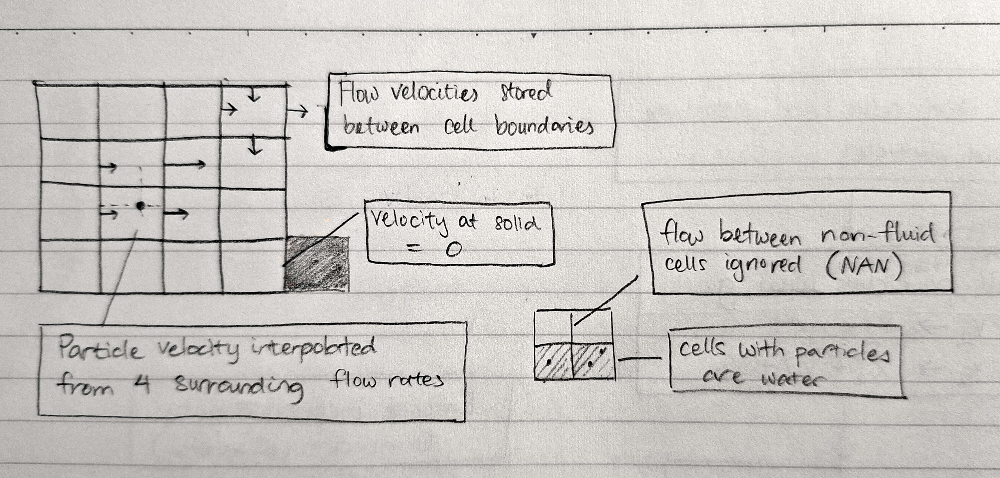
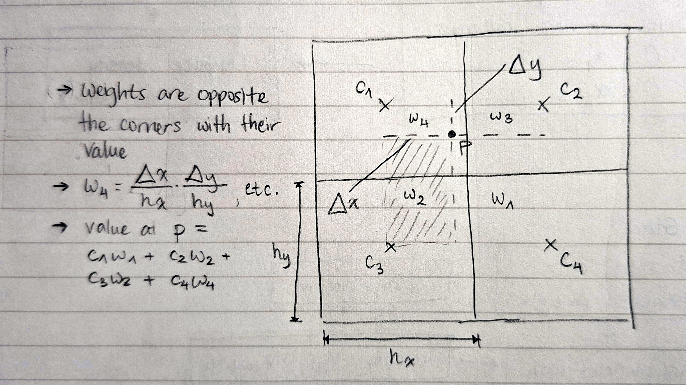
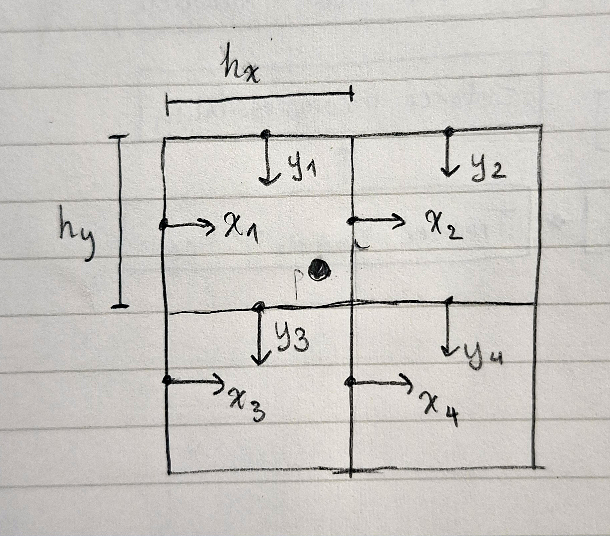

Writing simulations isn't one of my main interests, per se, but it is pretty useful for controls engineering. Also, I couldn't get my hands on a [pendant made by mitxela](https://mitxela.com/projects/fluid-pendant) in time, so I plan to make my own version at some point. Hence, I decided to do this FLIP (**FL**uid **I**mplicit **P**article) simulation, using the [explanation](https://www.youtube.com/watch?v=XmzBREkK8kY) by Ten Minute Physics.

I honestly had some trouble replicating the simulation behaviour. For no discernible reason, my simulation has a bit higher viscosity than expected, and some overcompression of particles at the bottom. Though I am not totally happy with the result, I haven't yet found how to fix it. I'll make an update once I do.

2025-12-05 🥂: Fixed the viscosity issue! Viscosity occurs when particles adopt their neighbours' velocities. The origin was a bug in `reset_velocity_field()` which initialised interpolation weights to `1.f` instead of `0.f`. This likely wasn't caught because this was expected in a previous revision. I must've missed changing it after moving to FLIP.

### demo

But first! a demo.

<div class="aspect-ratio-3_2">
<iframe class="video" src="https://www.youtube.com/embed/L2p2-VZA64A?si=P41QRPNOtwL6cuND&rel=0" title="YouTube video player" frameborder="0" allow="accelerometer; autoplay; clipboard-write; encrypted-media; gyroscope; picture-in-picture; web-share" referrerpolicy="strict-origin-when-cross-origin" allowfullscreen></iframe>
</div>

### code

::github{repo="the2nake/flip"}

## algorithm summary

**The FLIP algorithm simulates a visually realistic fluid** using a body of particles and a set of cells in a grid. They create the "moving" and "flowing" properties, respectively. The diagram below illustrates the three cell types (air, fluid, and solid) and some interactions of interest.



The particles dictate where the fluid actually is. They all store position and velocity vectors, and in each simulation step are used to account for external forces (e.g. gravity). This is called **advection**.

By storing the rate of flow in/out of the cell, the net (`out - in`) flow rate can be computed. This value is then used for incompressibility, i.e. balancing the flow rate to zero at each cell. This is called **projection**.

---

**Why not use only particles or only cells to achieve this?**

It's actually possible! This is the Eulerian fluid simulation, which uses only cells to model fluid movement. However, we want to create an air-water boundary, which is hard to determine without particles.

---

Because we use this dual velocity representation with flow rates and particle movement, we require a transfer step from particles to velocities and back again.

These transfer steps, as well another nuance I will get to later, rely on **bilinear interpolation**. Essentially, we blend 4 bounding corners using the relative position of a particle contained within their bounds. This will be explained in more detail in the relevant section(s).

The combination of these steps--advection, projection, and transfer--is shown here (Fig. 2).


### approach

My main targets for this project included limiting memory usage (where possible) and making the code run as fast as possible. Both of these, I hope, will help in transferring the code to an embedded platform at some point.

[spoiler] I managed to hit 14ms per frame for >10k cells and >25k particles, so I think this turned out alright.

## implementation (+ challenges)

I tried to guide my approach with these ideas:

- Make each simulation step as divorced as possible from its preceding/following steps
- Try to limit dynamic memory allocation (`malloc`) to particle data (particle count changes with different starting setups)
- Use dual indices for cell data and single indices for other things

That last bit turned out to be unwise. The rationale, at the time, was that "this is nice and consistent" :clown_face:. However, this divide led to **many** errors when converting between flow rate indices and cell indices.

Another lesson learned, I suppose. Mixing indexing schemes between coupled data is _not_ smart.

### particle collisions

With the walls, this is trivial, but I still _(sigh)_ managed to make some dumb mistakes. Notably, I trapped particles mid-air by pushing particles back by their velocity instead of the container wall normal.

Notably, upon a collision, only the velocity component _orthogonal to the surface normal_ should be kept. In other words, you lose momentum when you run into a wall.

Collisions between two particles, however, is more difficult. In a nutshell, I generated a hash table of `cell -> contained particles` to limit collision check distances to a particle's surroundings. I'll probably describe this in more detail in another post.

### density computation

The idea is to smooth a particle's density impact across cells with bilinear interpolation. I think the best way to understand this is visually, so check out Figure 3. Do note that densities are placed at the centre of cells, not at corners.



You may notice that the above specifies calculation of a _particle's density_, not the density at a cell. This is for simplicity's sake; you actually have to do this process in reverse.

Here's a trimmed down implementation for this process. For each particle, we increment the density at each corner by its corresponding weight.

```cpp title="density interpolation"
// find the indices of the four cells
int i0 = particles[i].x2 / CELL_H - 0.5f;
int j0 = particles[i].x1 / CELL_W - 0.5f;
int i1 = imin(i0 + 1, SIM_H - 1);
int j1 = imin(j0 + 1, SIM_W - 1);

// compute interpolation weights
float f1_x1 = particles[i].x1 / CELL_W - (j0 + 0.5f);
float f1_x2 = particles[i].x2 / CELL_H - (i0 + 0.5f);
// for area closer to the top-left
float f0_x1 = 1.f - f1_x1;
float f0_x2 = 1.f - f1_x2;

float *surrounding[4] = {&densities[i0][j0], &densities[i0][j1],
                         &densities[i1][j0], &densities[i1][j1]};
float factors[4] = {f0_x2 * f0_x1, f0_x2 * f1_x1,  //
                    f1_x2 * f0_x1, f1_x2 * f1_x1};

// ignore solid cells
float sum_density = 0.f;
for (int k = 0; k < 4; ++k) {
  sum_density += isnan(*surrounding[k]) ? 0.f : factors[k];
}

if (sum_density > 0) {
  for (int k = 0; k < 4; ++k) {
    *surrounding[k] += factors[k] / sum_density;
  }
}
```

Surprisingly, I got this right on the first try, aside from having the corner weights reversed. The output for that only looks slightly noisier than the correct output.

I think there is something to be said for knowing when not to chalk errors up to "numerical noise" or some other hand-wavy nonsense. On the other hand, sometimes that is the truth.

### incompressibility

Don't worry, I haven't skipped a step here. I believe it is better to delay implementing velocity transfer until the end. For now, setting the flow rate boundary to just that of one particle is sufficient.

In the projection step, we enforce incompressibility by augmenting inward flow rates by a positive average flow (`net flow / # of neighbours`) and reducing outward flow rates. When the net flow is negative, we do the opposite.

In a single pass, this operation fixes flow rates for one cell but breaks them for the surrounding cells. So, projection is done iteratively, with each iteration slightly balancing the flow rates of every cell.

Here's the code, annotated with key steps.

```cpp title="projection step"
for (int n = 0; n < iters; ++n) {
  for (int i = 1; i < SIM_H - 1; ++i) {
    for (int j = 1; j < SIM_W - 1; ++j) {
      if (states[i][j] != water_e) continue; // only water cells flow

      // find flow rates to adjust
      bool sl = states[i][j - 1] != solid_e; // water doesn't flow into solids
      bool sr = states[i][j + 1] != solid_e;
      bool su = states[i - 1][j] != solid_e;
      bool sd = states[i + 1][j] != solid_e;

      int s = sl + sr + su + sd;             // # of free flow rates
      if (!s) continue;

      // compute average flow rates
      const int v1_i = i * (SIM_W + 1) + j;  // left flow rate (going in)
      const int v2_i = i * SIM_W + j;        // top flow rate (going in)

      float *vl = &v1[v1_i];
      float *vr = &v1[v1_i + 1];
      float *vu = &v2[v2_i];
      float *vd = &v2[v2_i + SIM_W];

      float flow = (*vr + *vd - *vl - *vu)                 // net flow
      flow -= k_stiffness * (densities[i][j] - DENSITY_0); // separate dense areas
      flow *= k_relax / s;                                 // 1 < k_relax < 2

      *vl += sl * flow;
      *vr -= sr * flow;
      *vu += su * flow;
      *vd -= sd * flow;
    }
  }
}
```

`DENSITY_0`: rest density of the fluid. I set this to the number of particles starting in each cell.

`k_relax`: over-relaxation constant. By compensating for a greater net flow rate than exists, fewer iterations are required.

The initial steps were pretty easy, but I got stuck here. If I had to guess, it's probably because there are a lot of numbers and it was a lot to keep in my head at the same time.

Some of my mistakes:

- Ignoring the boundaries attached to air cells
- Computing with `NAN` instead of `0`
- Swapping indices between flow rate fields `v1` and `v2`

Visualising the flow rates turned out to be most helpful for fixing these mistakes. _Especially_ for the last one.

I am still not fully finished dealing with issues here, I think. My simulation has a lot of viscosity, even before separating particles. Surely, the issue lies with incompressibility or with separation based on density. Or maybe something else. Anyway, something is up.

On the bright side, it looks alright.

**2025-12-05** 🥂: Fixed! see opening note for details. Regrettably, I had to enlist the help of a clanker...

### velocity transfer

Now, it's time to add the final component. We aim to generate flow rates based on the velocity of the closest particle, and use the same blending to reconstruct the particle's velocity after incompressibility is assured.

Like for density above, bilinear interpolation is our friend, although the coordinate system is a bit different. It is of particular importance to identify the correct corners to interpolate from, as they will differ for `v1` and `v2` (x and y velocities).

The diagram below shows the correct corners to use. Note that the particle must always be within the bounding box created by the four corners of both x and y flow rates.



Here's a skeleton of what the implementation for transferring particle velocities to the flow rate grid would look like. I had to omit a lot of the details, but the essence is to store bilinear interpolation weights with their boundaries' indices. This is done to use the computed weights for both for taking the weighted average of particle velocities surrounding a boundary and to reconstructing the particle velocity.

```cpp title="velocity transfer: particle to grid"
typedef struct {
  int i;    // index in v1/v2
  float w;  // influence on particle (and vice versa)
} vel_weight_t;

void v_to_grid() {
  // reset velocity field weights
  // set cell states based on particle positions

  for (int i = 0; i < n_particles; ++i) {
    compute_weights(&particles[i], &vel_ws[8 * i]);

    for (int j = 0; j < 4; ++j) {
      // fill the boundary with velocity and weight
      add_weight(v1_e, &vel_ws[8 * i + j], particles[i].v1);
      add_weight(v2_e, &vel_ws[8 * i + j + 4], particles[i].v2);
    }
  }

  // at each cell boundary, divide each flow rate by its weight
}

// populate vel_ws with:
//   the weights exerted by the particle
//   the indices of relevant cell boundaries
void compute_weights(particle_t *p, vel_weight_t *vel_w);

void add_weight(field_e_t field, vel_weight_t *vel_w, float vel) {
  // set is_air = velocity between two cells with air state

  if (is_air) {
    vf[vel_w->i] = NAN;
    wf[vel_w->i] = 0.f;
    vel_w->w = 0.f;  // mark influence on particle as invalid
  } else {
    vf[vel_w->i] += vel_w->w * vel;
    wf[vel_w->i] += vel_w->w;
  }
}
```

Once that is done, the transfer process in reverse is dead easy. We can take the weighted average of the four corner flow rates using the weights stored in `vel_ws` (called the PIC or particle-in-cell method). The FLIP method calls for computing the change in flow rate after projection and using that to avoid viscosity from converging velocity within a cell. The code for that is show below:

```cpp title="velocity transfer: grid to particle"
void update_particle(int i, field_e_t field, float flip) {
  assert(-0.01 <= flip && flip <= 1.01);

  vel_weight_t *vel_w = &vel_ws[8 * i + (field == v2_e) * 4];
  float *vf           = field == v1_e ? v1               : v2;
  float *v_prior      = field == v1_e ? v1_prior         : v2_prior;
  float *v_out        = field == v1_e ? &particles[i].v1 : &particles[i].v2;
  float v_pic = 0.f, v_flip = 0.f, w = 0.f;

  for (int j = 0; j < 4; ++j, ++vel_w) {
    if (vel_w->w == 0.f || isnan(vf[vel_w->i])) continue;

    v_pic += vf[vel_w->i] * vel_w->w;
    v_flip += (vf[vel_w->i] - v_prior[vel_w->i]) * vel_w->w;
    w += vel_w->w;
  }

  if (w > 0.f) {
    v_flip = *v_out + v_flip / w;
    v_pic = v_pic / w;

    *v_out = lerp(v_pic, v_flip, flip);
  }
}
```

By using linear interpolation (lerp), where $\text{lerp}(a, b, t) = a + (b-a)t$, we can blend the results of PIC and FLIP to achieve a realistic simulation.

PIC introduces viscosity as particles in same area blend their velocity, while FLIP introduces noise as it accumulates the derivative of flow rates after enforcing incompressibility.

This one was really challenging, and I kept getting errors with the particles flying out of bounds or division by zero weight. I would often think that I had fixed them, and then they would come back affecting different particles instead.

Inspecting the problematic particles and sprinkling `assert` statements throughout the code to crash when something was up really helped here.

My implementation's not quite perfect. It fails to properly separate the particles at the bottom, but I don't think this has a large impact on the simulation overall; the density compensation creates a corresponding gap above them.

## closing thoughts

This was an interesting challenge, despite seeming rather simple initially. Writing a simulation is quite a different task compared to other things I've done. Most notably, debugging a simulation necessitates handling a lot of data at a time to even understand what numbers are telling you. I definitely wish I had been more methodical and planned out each step precisely. It seems that with simulations, errors are particularly difficult to address while being not too much more difficult to prevent using normal programming methods.

Though the result is not flawless, I am mostly happy that I could learn some new techniques. Recently, I realised that I have a tendency to think of algorithms in terms of "themes" or, in other words, general approaches to their respective problems. In that sense, the projection and particle separation steps are quite satisfying. The projection step takes very simple, fast steps to reach its desired state iteratively, while the particle collision checks are sped up by impressive magnitudes through the hash table (which I had never thought could be applied here).

I had a lot of fun making this, and I hope this blog post has conveyed some of that to you. Thank you for reading, and stay tuned for updates, as I aim to bring this to a physical prototype soon.
