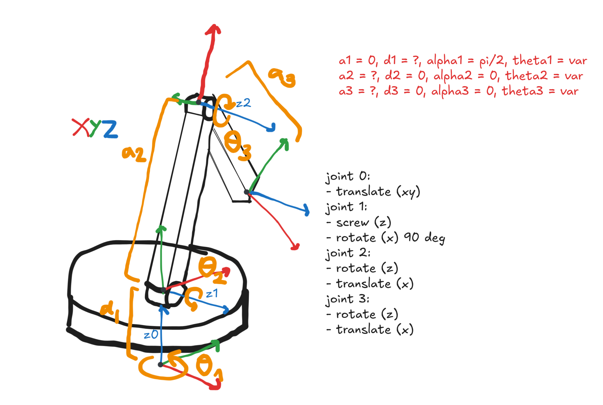

One of the conceptually simplest ways to teach a robot to act intelligently is to have it mimic human input. However, a good "expert" dataset can only be obtained if the human can control the device as if it were an extension of their own body. To eventually teach a robot arm to automate some simple physical tasks, I decided to create this "forward kinematic arm" as a sort of 3D mouse that tracks my movements and generates a training dataset of me doing various tasks.


The arm is an unpowered linkage with three potentiometers placed at each location where joints can rotate. There is one in the base, one on the rotating platform/turret, and one placed at the "elbow". When the link lengths are known, trigonometry can be used to compute the position of the arm's tip relative to its base. Then, assigning a coordinate frame to the base allows measurements to be made.

I also added an automatic calibration system, with which the arm can precisely estimate its own parameters (relative position, link lengths, and other coefficients) when given some points of reference. This was done by employing the gravitational search metaheuristic described in [this paper](https://pmc.ncbi.nlm.nih.gov/articles/PMC10304751/#B13-sensors-23-05368).

---

## hardware selection

In general, I mostly used cheap and readily available components from Amazon. I used an Arduino Leonardo to interface between my laptop and the sensors. Consulting with my professor, I also learned to pick out some useful hardware like thrust bearings (to support the turret) and MakerBeam extrusions (allowing more rigidity than a fully 3D printed design). Here's a rough parts list:

- [Potentiometers](https://a.co/d/00tr50I6)
- [Thrust bearings](https://a.co/d/07Qh6RBU)
- [Flanged ball bearings](https://a.co/d/0cTVoxgD)
- [T-slot extrusion (600 x 10 x 10)](https://a.co/d/0i9hzxDB)
- [3-pin cable extension](https://a.co/d/07lWsfC2)

## designing the arm

After selecting the hardware, I searched the internet and found their CAD models. Using Onshape, I designed an initial concept, trying to minimise the footprint of the base as much as possible.


I had some decent ideas here, I think. The herringbone gears would allow the weight of the upper arm to sit on the ball bearings instead of the potentiometer, and slotting printed joinery into the T-slot extrusions would theoretically eliminate a lot of play.

However, this first design had two major issues. First, it couldn't hold down the bottom potentiometer firmly, because the base was one solid piece of plastic with limited accessibility. Second, it overly relies on small parts that are difficult to print, such as the prongs that slot into the extrusions and the teeth on the gears. After completing an initial print, I immediately knew that it was time to go back to the drawing board.


## a second revision

Based on the issues encountered with the first concept, I decided to reduce the complexity as much as possible. The second version has a new base potentiometer attachment and a split base to provide easier access. Instead of using gears, all the joints clamp onto the potentiometers' knobs. I also made sure to add cutouts, increasing flex where needed to account for the fact that 3D printed parts would not be dimensionally exact.


---

## fabricating parts

It's pretty rare that things will translate perfectly from CAD to the real world, and even though Bambulab makes pretty good printers, functional parts still need a bit of tuning. I quickly found this out while testing the press fits for the ball bearings.


Most of the compliant parts turned out alright, although the clamp on the bottom potentiometer went through a couple more prints. Because it needs to clamp more strongly than the other joints (being the thing that keeps the rotating stack together), I often broke it by overtightening or by making it too thick and not sufficiently compliant.

During this process of making small adjustments to the part designs, I learned something new about 3D printing. Printing multiple small parts on the same plate can allow for a little more time for each layer to cool, thereby improving dimensional accuracy.

## assembly

Putting together this arm was fairly simple, since I was always making sure that it was theoretically possible to put together. However, there were still sometimes difficulties reaching into the little crevices and being able to apply pressure to the side of a nut to fasten it. I wish I had a photo to show here, but some serious finger acrobatics were required. Things in CAD always look a lot larger than they end up being in real life.

---

## interfacing with the sensors

Using PlatformIO, I set up some simple code to grab an analog input from each potentiometer and relay them via the serial connection to my computer. Because the Leonardo MCU has a 10-bit ADC, the 270-degree range of the potentiometer is divided into a resolution of $270 / 2^{10} \approx \boxed{\pm 0.3}$ degrees. This is just not precise enough; converting to radians and then multiplying by the length of a single link (~300 mm), a single joint would introduce an uncertainty of $\pm 1.57$ mm.

I solved this by oversampling. An extra bit of precision is produced by sampling from the ADC 4 times and then dividing by 2 (having twice as many samples counteracts noise). Doing this 3 times, each potentiometer gets a resolution of $\pm 0.04$ degrees, which is definitely better despite increased accuracy not being guaranteed.

```cpp
long oversample(int pin, int bits) {
  long sum = 0;
  for (int i = 0; i < int(pow(4, bits)); ++i) {
    sum += analogRead(pin);
  }
  return (sum >> bits);
}
```

## forward kinematics

Once I had gotten some simple Python code to read the received sensor measurements written, the next step was to figure out the equations for the endpoint coordinates. The trigonometry to perform forward kinematics is very simple, but I decided to expand my horizons a bit and learn the more standard approach of using homogeneous transformation matrices.

The most popular variant of this is the Denavit-Hartenberg convention, which rigidly attaches a coordinate frame to each link of the robot arm and represents the transformations between them using two successive screw transforms: one in the Z (joint) axis and one in the X axis. Using [this pdf](https://users.cs.duke.edu/~brd/Teaching/Bio/asmb/current/Papers/chap3-forward-kinematics.pdf) as a reference, I made the following mockup of the coordinate frames.



Here's something I found quite interesting when figuring out how the transformation matrices are used: the multiplications are performed left-to-right. I'm used to seeing transforms like $AB\bf{x}$, for example, where B is applied first. However, to use homogeneous transformations, you need to chain them like so $H_0H_1H_2\cdots$. The last column of $H_n$ has x-y-z entries that translate by the first three columns of $H_{n-1}$ (the orientation of the previous frame), and then the fourth "1" entry adds it to $H_{n-1}$'s origin coordinate.

## automatic calibration

## gravitational search

## results & cloning demo

---

## reflections

If I were to do something like this again, I would primarily focus on improving the mechanical reliability. For example, to reduce play in the coaxial direction of the joints, I would make each joint wider, with disc-like contact areas instead of being pivots on a fixed screw. I would also change the mounting of the rotating platform, either adding compression or using bearing stacks to retain the turret and prevent the arm's weight from loosening the clamp on the potentiometer over time.

Swapping out the potentiometers for Hall effect sensors would also be a good idea, since it would provide greater resolution and stronger linearity. It helps to clarify if the small errors I saw were caused by measurement error when collecting calibration data or by poor metaheuristic tuning.

I had a lot of fun working on this, and though I'm happy with what it does right now, I wouldn't mind taking another crack at the problem.
