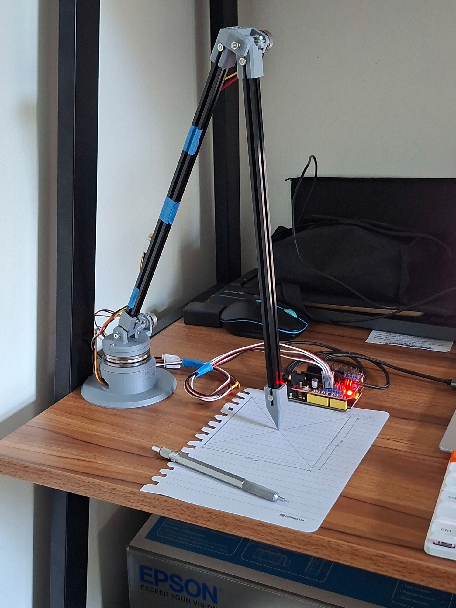
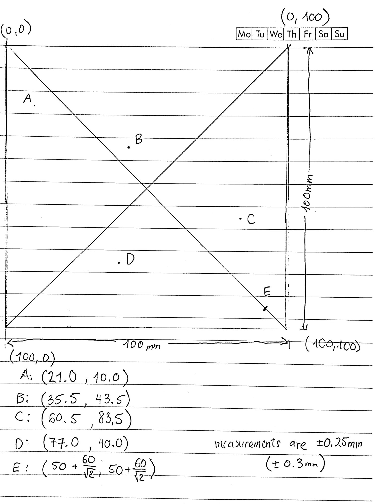
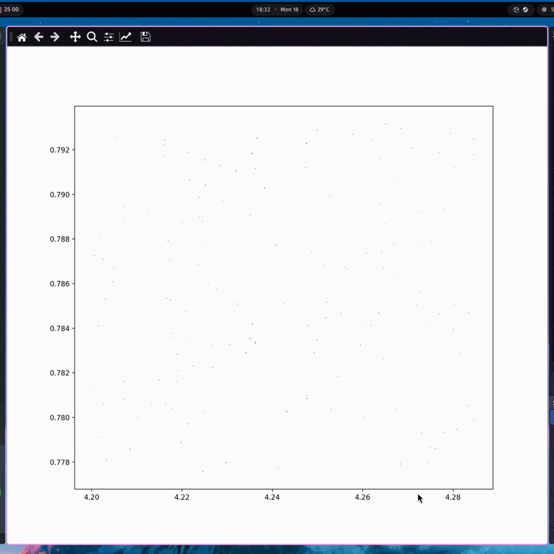

One of the conceptually simplest ways to teach a robot to act intelligently is to have it mimic human input. However, a good "expert" dataset can only be obtained if the human can control the device as if it were an extension of their own body. To eventually teach a robot arm to automate some simple physical tasks, I decided to create this "forward kinematic arm" as a sort of 3D mouse that tracks my movements and generates a training dataset of me doing various tasks.

::github{repo="the2nake/3d-measurement-arm"}



The arm is an unpowered linkage with three potentiometers placed at each location where joints can rotate. There is one in the base, one on the rotating platform/turret, and one placed at the "elbow". When the link lengths are known, trigonometry can be used to compute the position of the arm's tip relative to its base. Then, assigning a coordinate frame to the base allows measurements to be made.

I also added an automatic calibration system, with which the arm can precisely estimate its own parameters (relative position, link lengths, and other coefficients) when given some points of reference. This was done by employing the gravitational search metaheuristic described in [this paper](https://pmc.ncbi.nlm.nih.gov/articles/PMC10304751/#B13-sensors-23-05368).

---

## hardware selection

In general, I mostly used cheap and readily available components from Amazon. I used an Arduino Leonardo to interface between my laptop and the sensors. Consulting with my professor, I also learned to pick out some useful hardware like thrust bearings (to support the turret) and MakerBeam extrusions (allowing more rigidity than a fully 3D printed design). Here's a rough parts list:

- [Potentiometers](https://a.co/d/00tr50I6)
- [Thrust bearings](https://a.co/d/07Qh6RBU)
- [Flanged ball bearings](https://a.co/d/0cTVoxgD)
- [T-slot extrusion (600 x 10 x 10)](https://a.co/d/0i9hzxDB)
- [3-pin cable extension](https://a.co/d/07lWsfC2)

## designing the arm

After selecting the hardware, I searched the internet and found their CAD models. Using Onshape, I designed an initial concept, trying to minimise the footprint of the base as much as possible.


I had some decent ideas here, I think. The herringbone gears would allow the weight of the upper arm to sit on the ball bearings instead of the potentiometer, and slotting printed joinery into the T-slot extrusions would theoretically eliminate a lot of play.

However, this first design had two major issues. First, it couldn't hold down the bottom potentiometer firmly, because the base was one solid piece of plastic with limited accessibility. Second, it overly relies on small parts that are difficult to print, such as the prongs that slot into the extrusions and the teeth on the gears. After completing an initial print, I immediately knew that it was time to go back to the drawing board.


## a second revision

Based on the issues encountered with the first concept, I decided to reduce the complexity as much as possible. The second version has a new base potentiometer attachment and a split base to provide easier access. Instead of using gears, all the joints clamp onto the potentiometers' knobs. I also made sure to add cutouts, increasing flex where needed to account for the fact that 3D printed parts would not be dimensionally exact.


---

## fabricating parts

It's pretty rare that things will translate perfectly from CAD to the real world, and even though Bambulab makes pretty good printers, functional parts still need a bit of tuning. I quickly found this out while testing the press fits for the ball bearings.


Most of the compliant parts turned out alright, although the clamp on the bottom potentiometer went through a couple more prints. Because it needs to clamp more strongly than the other joints (being the thing that keeps the rotating stack together), I often broke it by overtightening or by making it too thick and not sufficiently compliant.

During this process of making small adjustments to the part designs, I learned something new about 3D printing. Printing multiple small parts on the same plate can allow for a little more time for each layer to cool, thereby improving dimensional accuracy.

## assembly

Putting together this arm was fairly simple, since I was always making sure that it was theoretically possible to put together. However, there were still sometimes difficulties reaching into the little crevices and being able to apply pressure to the side of a nut to fasten it. I wish I had a photo to show here, but some serious finger acrobatics were required. Things in CAD always look a lot larger than they end up being in real life.

---

## sensor interface

Using PlatformIO, I set up some simple code to grab an analog input from each potentiometer and relay them via the serial connection to my computer. Because the Leonardo MCU has a 10-bit ADC, the 270-degree range of the potentiometer is divided into a resolution of $270 / 2^{10} \approx \boxed{\pm 0.3}$ degrees. This is just not precise enough; converting to radians and then multiplying by the length of a single link (~300 mm), a single joint would introduce an uncertainty of $\pm 1.57$ mm.

I solved this by oversampling. An extra bit of precision is produced by sampling from the ADC 4 times and then dividing by 2 (having twice as many samples counteracts noise). Doing this 3 times, each potentiometer gets a resolution of $\pm 0.04$ degrees, which is definitely better despite increased accuracy not being guaranteed.

```cpp
long oversample(int pin, int bits) {
  long sum = 0;
  for (int i = 0; i < int(pow(4, bits)); ++i) {
    sum += analogRead(pin);
  }
  return (sum >> bits);
}
```

## forward kinematics

Once I had gotten some simple Python code to read the received sensor measurements written, the next step was to figure out the equations for the endpoint coordinates. The trigonometry to perform forward kinematics is very simple, but I decided to expand my horizons a bit and learn the more standard approach of using homogeneous transformation matrices.

The most popular variant of this is the Denavit-Hartenberg convention, which rigidly attaches a coordinate frame to each link of the robot arm and represents the transformations between them using two successive screw transforms: one in the Z (joint) axis and one in the X axis. Using [this pdf](https://users.cs.duke.edu/~brd/Teaching/Bio/asmb/current/Papers/chap3-forward-kinematics.pdf) as a reference, I made the following mockup of the coordinate frame


Here's something I found rather interesting when figuring out how the transformation matrices are used: the multiplications are performed left-to-right. I'm used to seeing transforms like $AB\bf{x}$, for example, where B is applied first. However, to use homogeneous transformations, you need to chain them like so $H_0H_1H_2\cdots$. The last column of $H_n$ has x-y-z entries that translate by the first three columns of $H_{n-1}$ (the orientation of the previous frame), and then the fourth "1" entry adds $H_{n-1}$'s origin coordinate.

I also programmed a script providing live visualisation of the arm's position output and sensor values, which was super helpful in making sure there were no mistakes. Here's a video of that.

::youtube{url="https://youtu.be/RGo_suscU0I"}

## test methodology and initial results

With the forward kinematics completed, I simply needed to measure the link lengths (the values marked with a `?` in the previous diagram) to start testing. By moving the arm to known locations and measuring the difference between the measured and true positions, I could quantify how reliable the arm's measurements were.

I took a fairly low-tech approach to this, only taking measurements on a 2D surface at various points rather than the full 3D range of its capabilities. This approach ensured that the test data was as close to the ground truth as was possible to achieve with a pencil and straightedge. Below is a picture of said test points.



And here are the residual matrices when using configuration parameters (link lengths, base origin, etc.) measured by hand, showing errors in the x-, y-, and z-axes for each point in millimetres.

```txt
eval_calib(prior)=24.4723
residuals:
 -17.4979   10.5632 -0.516645  -15.9014  -5.60756
  23.9571   23.6728   19.3333   19.0631   23.4713
 -3.81774  -1.92279   7.16482   6.49571    2.3699

eval_test(prior)=23.8121
residuals:
-12.0629 -8.83594 -5.98396  1.03631 -1.11929
 24.9702  23.4213  20.5786  24.5784  20.5884
-2.67521  1.46891  5.23721  1.61009  6.47255
```

Each column above shows the deviation of the measured positions from the true values for a test point. The scores `eval_calib` and `eval_test` are the norms of the MAE (mean absolute error) vector for each dataset. An average measurement error of >20mm is clearly unacceptable, so I focused my efforts towards reducing it as much as possible.

## automatic calibration

After first confirming that the math for forward kinematics was correct, I then looked at the data used to compute the endpoint coordinates. The parameters for link lengths and potentiometer curves all had meaningful measurement uncertainty, and because forward kinematics works by chaining linear transformations, these errors compound. I hoped that automatic calibration would be able to produce better parameters or refine my rough measurements further.

Another justification for automatic calibration is for countering changes in the mechanics of the arm and in the work area being measured. If the fasteners loosen and shift the arm's dimensions, or if it is set up in a new space, it would be cumbersome to need to take 11 different measurements to restore its accuracy.

At a high level, the strategy is to use the MAE vector from some known calibration points as a fitness function for any set of configuration parameters, and run some algorithm to find the parameters minimising said fitness function.

## gravitational search

After some research, I found my way to [a paper on precision calibration of industrial robot arms](https://pmc.ncbi.nlm.nih.gov/articles/PMC10304751/#B13-sensors-23-05368). I chose to implement the gravitational search algorithm (GSA), which had the second-best experimental result, as I found that the artificial bee colony approach lacked sufficient detail for me to replicate and only performed slightly better.

Side note: This algorithm is *super cool*, and also *super intuitive*. Basically, if you spray a bunch of random points over the configuration space (vector space of all configuration vectors) near the true optimal, you can iteratively gravitate all the points towards the heaviest (best fitness) ones, and the paths that they trace to get to that true optimal can contain even better configurations that become the new "center of gravity".

To better visualise the algorithm and verify that my implementation was working, I made a toy example where GSA is used to find the polar coordinate representation of the Cartesian point $(3, 3)$, a problem analogous to the configuration of a single-link 2D arm with one calibration point. Shown below is an animation of the guess points attracting to the optimum.



For such a simple example, it is both overkill and works very well (this was accurate to something like $10^{-12}$). It also demonstrates the algorithm's capacity to escape local minima. Even when the initial best random point is not near at the true minimum, the points sweep through a wide region of the configuration space to find it. 

I wish I could do a similar visualisation for the actual 11-dimension parameter space, but it turns out that that is mildly challenging.

Here are a couple more interesting things about this method (in no particular order):

- The fitness of every potential configuration is recomputed at every iteration
- Gravity decays over time. This seems to help with making smaller adjustments as the points get closer to the true optimum
- A small constant distance is added when computing gravitation to prevent acceleration from blowing up
- Impacts from the scale of the fitness function are mitigated using the mass formula below, and then normalising the masses to sum to 1 across all points.
  - $m_i(t)=\dfrac{f_{worst}(t)-f(X^i)}{f_{worst}(t)-f_{best}(t)}$
  - *However*, I obtained better results without normalising the masses
  - Also, since the denominator is constant, it doesn't make sense to divide it if later the sum of all the masses is going to be normalised to 1 (I tested that the numerical result is identical). Perhaps the authors overlooked this?
- Force is inversely proportional, not inversely quadratic, to distance. I suspect this improves the speed of optimisation. 

For anyone interested, the code implementing GSA can be found in the `grav/` directory in the repository linked at the beginning of this post. Alternatively, here is a more optimised version that is a bit cleaner, though written in Rust.

::github{repo="the2nake/arm-calibration"}

## improved results

I was rather surprised by the improved performance after optimisations. The arm is now accurate to 4mm, an 80% reduction in MAE, with improved accuracy and lower error variance in all three dimensions. The following printout summarises the results.

```txt
gsa: score(calib) = 5.02, iter = 354 / 1000
     score (test) = 4.07
residuals:
 -5.60037  -2.09744   1.17592   2.79669   4.21243
 0.596151 -0.803908  -3.40679 -0.630639  -3.95111
 -2.59093  -1.63505  -1.41447   -1.6431   -1.2499
```

To be clear, this isn't *that* good. However, given the relatively poor mechanical construction and the introduction of human measurement error at nearly every step in the process, including those not mentioned in this blog, it's not bad either.

## movement cloning demo

Enough about the data, now. Here's what the arm can do.

::youtube{url="https://youtu.be/ZZk5l7IYkZo"}

Pretty cool, right? The 3-dof passive arm generates target coordinates with forward kinematics, and the 4-dof motorised arm runs inverse kinematics to match those motions. 

---

## reflections

If I were to do something like this again, I would primarily focus on improving the mechanical reliability. For example, to reduce play in the coaxial direction of the joints, I would make each joint wider, with disc-like contact areas instead of being pivots on a fixed screw. I would also change the mounting of the rotating platform, either adding compression or using bearing stacks to retain the turret and prevent the arm's weight from loosening the clamp on the potentiometer over time.

Swapping out the potentiometers for Hall effect sensors would also be a good idea, since it would provide greater resolution and stronger linearity. It helps to clarify if the small errors I saw were caused by measurement error when collecting calibration data or by poor metaheuristic tuning.

In any case, I had a lot of fun working on this, and though I'm happy with what it does right now, I wouldn't mind taking another crack at the problem once I've levelled up my mechanical design skills a little more.
