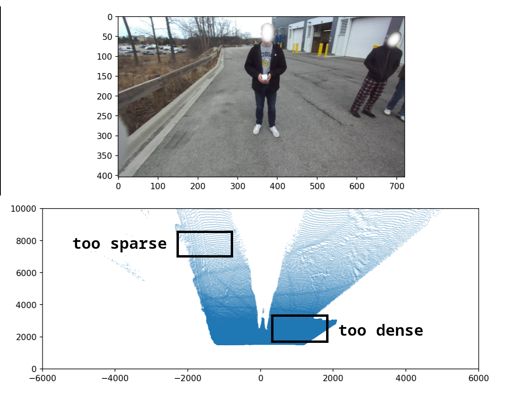
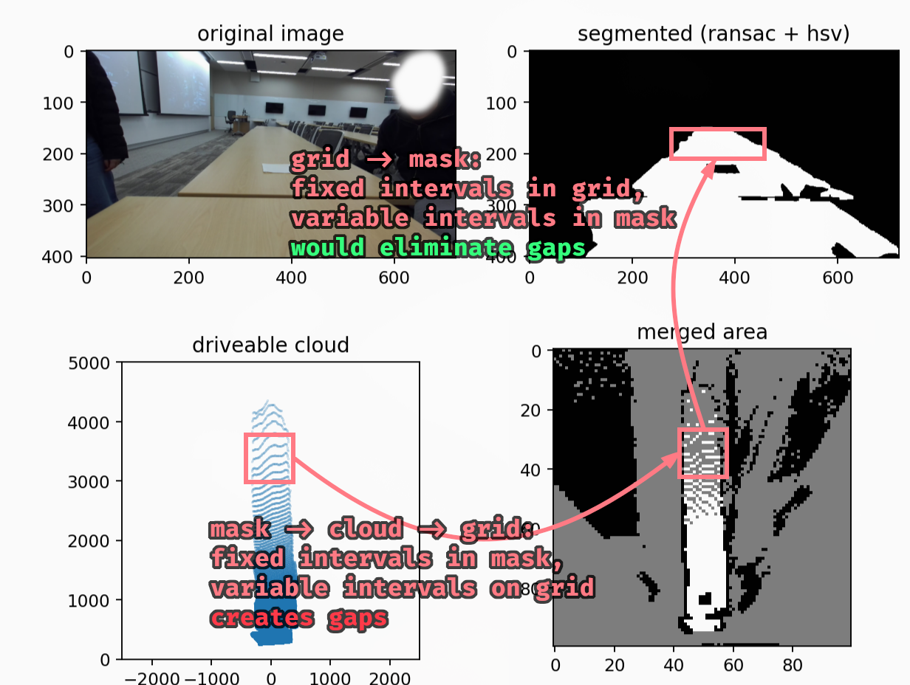
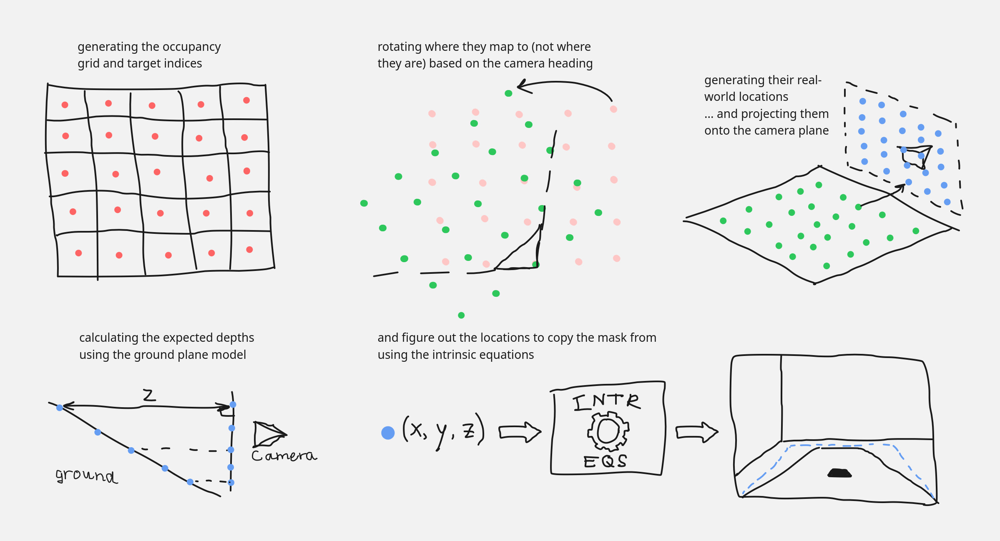
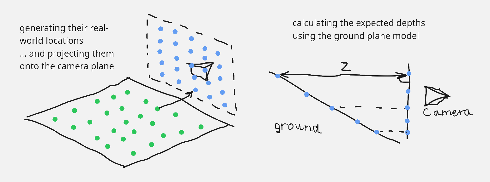
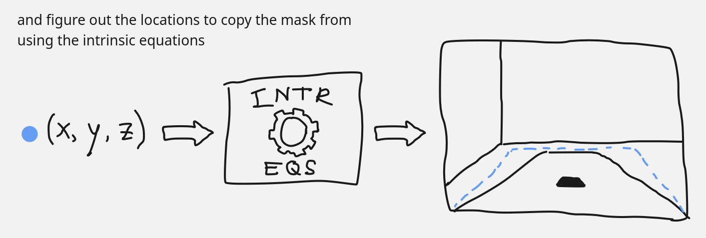
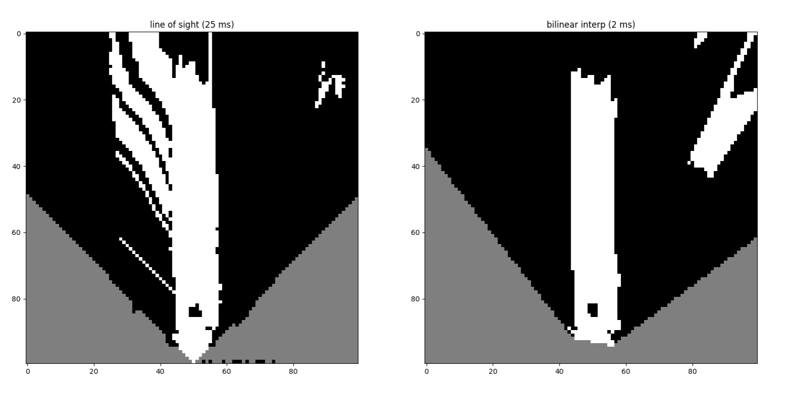
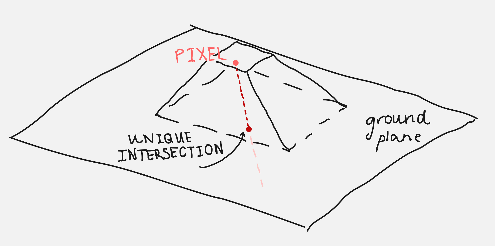

Hi, happy Pi Day! This post concerns a method I devised to generate an occupancy grid that is up to 20x faster than using point clouds. If you're reading this and would like some context for why this exists, or what janky method I was using before coming up with this, the latter half of my article on the ARV computer vision pipeline may interest you: [Depth vision for autonomous navigation](../navigating-with-stereo-vision/#occupancy-grid).

I just want to preface this post by reiterating that, while using a point cloud to figure out where obstacles are is not unheard of (in fact, I am fairly sure it is common in autonomous navigation), it was definitely the wrong approach in our context.

Additionally, the method that is detailed here is quite similar to how `cv2.warpPerspective` works, only adapted to our custom RANSAC algorithm.

I've included all of the code for this algorithm in this article, so it should be fairly easy to replicate.

## the problem with point clouds

Looking at any image taken by a camera, it is easy to see that the areas far away are not detailed, while areas close to the camera are. Equivalently, the same area of pixels covers a greater area in the real world if it is closer to the top. This density gradient is shown below.



This causes a complication with point clouds; if every 3-d point corresponds to a pixel on the image, the point cloud is dense near the robot and sparse far away. This is the effect that we tried to overcome using line-of-sight interpolation.

To summarise, the point cloud method is inefficient because it **(1) processes every pixel** in the mask (~300K) and also **(2) has gaps between cells**, wasting effort and requiring post-processing.

## arriving at the solution

Since interpolation was the slowest part and was only required for filling in the gaps, I tried prevent gaps first. Luckily, it turned out to solve the other problem at the same time.

The key insight (for me) was realising that *theoretically, **97%** of the pixels should not matter*, because we map from a `720x404` image to a `100x100` image. Additionally, as data is less dense moving away from the camera, our algorithm should match multiple grid cells to the same mask pixel.

The above is a pretty straightforward hint that the function we want is a mapping from the occupancy grid to the mask, not from the mask to the occupancy grid.



The better method, then, works like so: for each cell on the occupancy grid, we want to compute the corresponding pixel location on the image mask, and copy the information over. This is good; it lets us reuse the plane-fitting work we did for RANSAC and avoid rotation matrices altogether!

## the devil (is in the details)

Though this method is wayyy faster (computationally), it was a bit more difficult to implement. In retrospect, it is also easier to understand something *after* having the key insights rather than before.

I'll explain a simplified version of the code, which removes the sampling we do to allow for greater accuracy. First, a quick visualisation of all the steps together.



All of the logic is contained within one function, which takes in the mask, the coefficients describing the ground plane (in real world coordinates), the camera intrinsics, and some configuration parameters.

```python
def oneshot(mask_in, real_coeffs, intr: Intrinsics, conf: GridConfiguration,
            pos: CameraPosition, thres=200):
    # setup the grid dimensions 
    grid_shape = (2 * int((0.5 * conf.gh) // conf.cw),
                  2 * int((0.5 * conf.gw) // conf.cw))
    true_width = conf.cw * grid_shape[3]
    true_height = conf.cw * grid_shape[2]
```

---

Then, we convert the indices of the grid cells into their corresponding locations in the real world, relative to the center of the robot.

```python
    # list of grid coordinates
    gys = np.arange(grid_shape[0])[:, None]
    gxs = np.arange(grid_shape[1])[None, :]

    # [rotation code goes here]

    # occupancy grid locations into mm
    cxs = conf.cw * (0.5 + rgxs) - 0.5 * true_width
    cys = true_height - conf.cw * (0.5 + rgys)
```

This is effectively scaling by the grid cell widths and then performing some translations/reflections as necessary.

Note the use of `rgxs` and `rgys`: before we move on, it's important to handle the camera orientation *before* the conversion to real-world units; doing so after would introduce gaps due to the offsets. We also *never* change the target cell indices `gys` and `gxs`, which is critical to preserve the no-gaps property we want.

```python
    # apply camera rotation around the correct point
    rgxs = gxs - grid_shape[1] / 2 + 0.5 - (pos.x / conf.cw)
    rgys = grid_shape[0] - gys - 0.5 - (pos.y / conf.cw)
    # make temporaries to have them not affect each other
    rgxs_tmp = rgxs * math.cos(pos.h) + rgys * math.sin(pos.h)
    rgys_tmp = -rgxs * math.sin(pos.h) + rgys * math.cos(pos.h)
    # intr.tx term compensates for depths being centered on left camera lens
    # shift "after" rotation because rg{x,y}s used to poll from the mask
    rgxs = rgxs_tmp + grid_shape[1] / 2 - 0.5 + (intr.tx / conf.cw / 2)
    rgys = grid_shape[0] - rgys_tmp - 0.5
```

The main thing to note in the above code is that shifts in the camera point of view happen after the rotations, since the mapping is from robot-oriented space to camera-aligned space.


---

With the real-world positions of each cell computed, we project those coordinates onto the camera plane, which is the next step in the process to get to the pixel coordinates.

```python
    # project onto the camera plane
    a, b, d = real_coeffs
    theta = ransac.plane.real_angle(real_coeffs)
    cam_height = math.sin(theta) * d
    cys = cys * math.sin(theta)
    cys = cys - math.cos(theta) * cam_height
```

This next bit is the main part. Here, the equation of the ground plane is used to predict the **expected** depth of the ground at that grid cell's location. It's important to note that we don't actually care if it is on the ground or not (I'll explain this later on).

```python
    # figure out depth locations
    zs = np.clip(a * cxs + b * cys + d, 1.0, None)
```



---

We needed the depths since the equations to convert real coordinates into pixel locations requires a depth value (since an image is 2-d and coordinates are 3-d).

```python
    # use intrinsics to get pixel depths
    pxs = np.round((cxs * intr.fx) / zs + intr.cx)
    pys = np.round(intr.cy - (cys * intr.fy) / zs)
```

Afterwards, we just do some basic manipulation with numpy to copy the pixels over.

```python  
    # ignore mask's outer edge
    mask = 255 * mask_in.astype(np.float16)
    mask[[0, -1], :] = np.nan
    mask[:, [0, -1]] = np.nan

    pxs = np.clip(pxs, 0, mask.shape[1] - 1).astype(np.int16)
    pys = np.clip(pys, 0, mask.shape[0] - 1).astype(np.int16)

    grid = np.zeros(grid_shape, dtype=np.float16)
    grid[gys, gxs] = mask[pys, pxs]
    
    grid = np.where(grid > thres, 255, grid)
    grid = np.where(grid < thres, 0, grid)
    grid = np.nan_to_num(grid, nan=127)
    return grid.astype(np.uint8)
```



---

That's all, the entire process to get from the mask (or, if we wanted, from the image) to a bird's-eye view occupancy grid. Since every single step consists only of vectorised operations, it's very fast.

Here's a side-by-side comparison of the results. I love it when significant performance uplifts come with no cost to quality 🥳.



## a note about assumptions

By the time I made this, I still had lingering questions. Is this method theoretically sound? How can we (essentially) assume that every grid cell is on the ground, and then check using the mask after the fact? Obviously, the code seems to work, but the *why* is important! ... to me, lol.

As it turns out, it does always work. First, the obvious case: if the cell is part of the ground, then using the ground plane is fine and the appropriate pixel will be matched on the mask. The other case is if the cell is part of an obstacle, and that is more confusing (again, for me).

In this case, I think it's good to ask this question: "in this case, what would make the algorithm fail?" The answer to this, of course, is "when a blocked area on the ground plane maps to a white (unblocked) pixel on the mask."

This leads to a similar, broader statement that is easier to disprove: "when two cells map to the same pixel." And we can show that this never happens if we think about the occupancy grid and the image mask as continuous spaces (forgetting about discrete cells and pixels). In retrospect, it's a bit obvious: any distance in the occupancy grid *has to appear* on the image as well. I've added a graphic below to visualise this.



Equivalently: every image pixel is the result of projecting a line of real-world points towards the camera, a line that only intersects with the ground plane once. Therefore, the pixel will be unoccupied if (and only if) the ground is visible; if not, the pixel would show an obstacle be copied onto the occupancy grid.

## closing thoughts

This has been a pretty crazy optimisation, and I'm not exactly sure how to feel about a lot of the work I put into making the naive point cloud solution work in somewhat-real time. I'm happy it's better, obviously, but this is kind of embarassing...

### why did i not figure this out before?

There were definitely ways I could've forseen this approach being better. In fact, if I did a little more reading I could even integrate `opencv-python` and make this even faster.

I think I just didn't see the connection and thought that the homography matrix can only work if you can identify the new point of view's location (with this being an orthogonal view, I thought it wouldn't work out). If only I had read a little more thoroughly, and given it a better think, I suppose.

### what i've learned

I've always been aware that out of all the ways you can optimise, algorithms are by far the most effective. This was a good reminder of that, and also a good lesson to read more about a problem before throwing compute at it. This is doubly true if it's a very common problem that probably has been solved in a similar context before.

In any case, that's all. I hope you all have a wonderful Pi Day!
