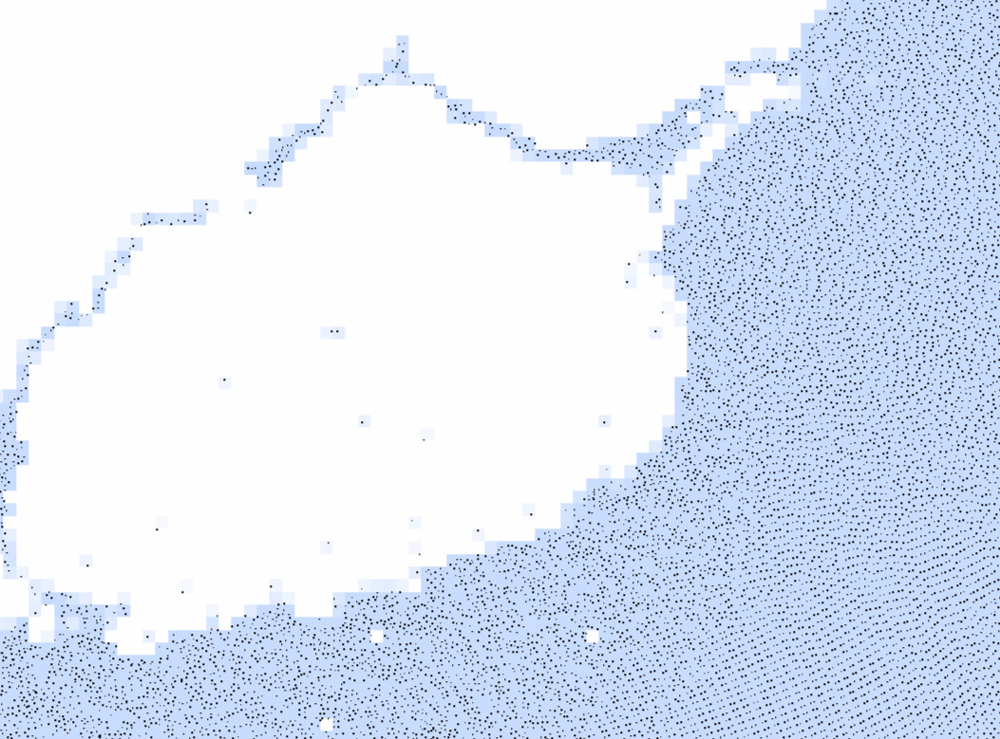
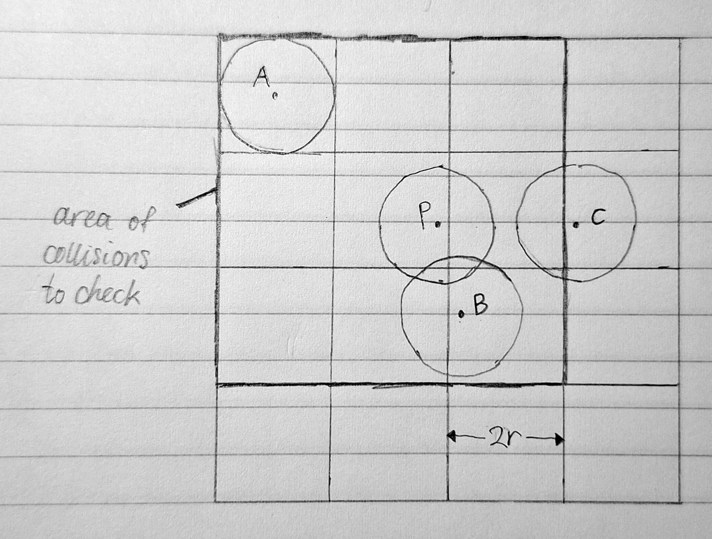
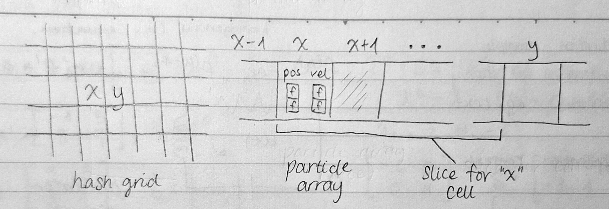
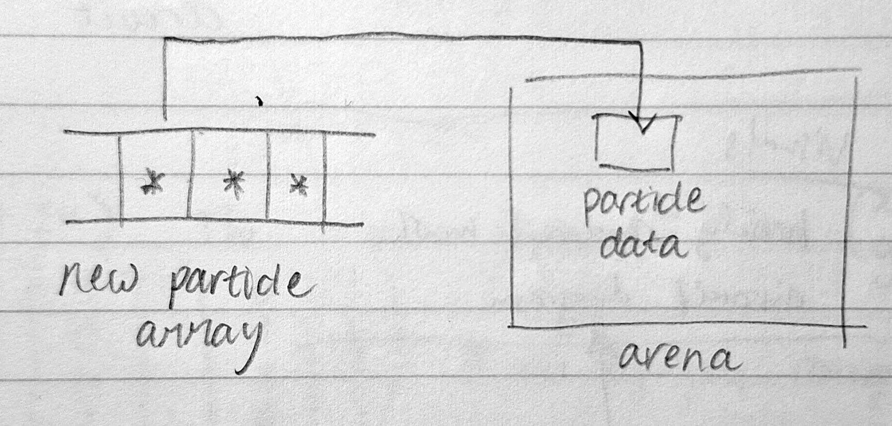

Happy New Year's Eve! This post concerns the solution to a problem mentioned in a previous post on simulating a fluid using FLIP: How can we detect (and separate) collisions between large amounts of uniform circular particles?

We will first start with the case of particles in a bounded 2-d area, then extend it to spherical objects in any Euclidean space--full credit to [Ten Minute Physics](https://www.youtube.com/watch?v=D2M8jTtKi44), who explained this algorithm. I mainly hope to explain implementation considerations in C, as well as consider the algorithm more conceptually.

## core idea

First, we have to figure out how to check for collisions between a pair of particles. Since they are circular, we can use the distance between their centre points (`std::hypot(x2-x1,y2-y1)`). If this distance is lower than twice their radius, there must be some overlap.

The so-called "naive" approach to extend this would be to check collisions between every pair of particles. This would run in $O(n^2)$ time, where $n$ is the number of particles checked. With only 1000 particles, 1 million pairs would need to be checked!

Our principal optimisation is this: we need only to check the immediate neigbourhood of each particle. If the particles are arranged in such a way that separates particles based on their location, we can skip the distant pairs without ever performing a distance check.

To do this, we can place the particles within a grid. If the grid has a grid spacing equal to the width of the particles, particles not in adjacent grid cells can never interact. One such grid is shown below.



In this example, we consider the 3 by 3 cell neighbourhood of particle P. We can see that all particles which collide with P (e.g., particle B) must lie within this neighbourhood. Particle C, being outside of the area, is ignored. However, the distance check is still needed, as particles like A may not collide.

We can locate the cell coordinates of a particle, and thus the neighbourhood to check, using the formula $x_g=\left\lfloor \dfrac{x_p}{h} \right\rfloor$, where $h$ is the grid spacing.

## memory layout

Of course, we need to consider how we actually lay out particle data memory, as this will determine how much performance we gain from this algorithm.

We should _not_ simply place the full particle data into each grid, as this incurs costs like needing to allocate space for an unknown number of particles in each cell.

We would then need to consider edge cases like a lack of space to place particles in a cell, or use dynamic memory allocation. In all likelihood, this strategy fragments memory and increases the chance for the CPU to read from cold memory (slower to access).

### hash grid

Instead, we can start by considering the fixed number of particles. We'll place all the particles in an array, and reorder them so that particles in the same cell sit in a contiguous slice of the array.

Then, we need a way to store which slice corresponds to each grid cell. Here's where the **hash grid** comes in: we create a grid where each entry just contains the starting index of the array slice mentioned above. This setup is shown below.



The hash "grid" does not have to be a grid. Though I visualise it like this to be more intuitive, it is implemented as a 1-d array of length `width * height + 1`, with `+1` cell to store the ending index of the slice for the bottom-right cell.

Our **hash function**, which we use to find the hash table cell for a set of cell coordinates, is $i(x_g, y_g) = y_g \cdot \text{width} + x_g$.

### memory arena

We can still optimise further. Consider that we will have to reorder the particle array every time the particles move. To reduce the amount of data copies, we can allocate a contiguous area of memory (called a **memory arena**) for the particle data, and place pointers (memory addresses) referencing each particle in the above particle array. The following image shows this modification.



With these modifications, we don't only reduce unnecessary distance comparisons! We also reduce memory fragmentation and memory copies, which means that more relevant data will be held in the CPU cache, and fewer CPU cycles are needed for each collision check.

### summary

This data structure is really 3 things:

- an array mapping `coords -> slice` (the actual hash table)
- an array of pointers to particle data (take slices from here)
- a memory arena (also an array... hehe...) of particle data.

It reduces many collision checks without needing to ever check irrelevant particle data.

## pseudocode

Since the code (in the FLIP simulation) for handling the hash grid is, ironically, very fragmented, I will provide pseudocode for the main operations relating to it.

```txt title="1. hash grid construction"
// this is run every frame (particle positions change)

// empty the hash table
set all entries in "lookup" to 0
set all entries in "pointers" to -1

// count particles in each cell
FOR EACH particle:
    compute and hash its grid location
    ++lookup[hash]

// prefix sum
sum = 0
FOR EACH entry IN lookup:
    sum += entry
    entry = sum before increment

// create particle array
FOR EACH particle:
    compute and hash its grid location
    look for a free spot in "pointers" after index lookup[hash]
    set position in "pointers" to address of particle in arena
```

```txt title="2. collision check"
// this is run for every particle, every frame

compute particle's grid location

FOR each cell in 3x3 area:
    hash cell location
    slice = lookup[hash] : lookup[hash + 1]
    FOR each other_particle in pointers[slice]:
        compute distance(particle, other_particle)
        IF distance < 2 * radius:
            // separate
            get midpoint
            push both particles equally

```

## extensions

What if we wanted to apply this technique to an arbitrarily large space, or to 3 (or more) dimensions?

The key for both of these modifications is the hash function. Remember that the hash grid is not really a grid, and let's tackle the higher-dimensional case first. We can use the following hash function instead:

$$
\begin{equation}
i(x, y, z) =z \cdot \text{width} \cdot \text{height} + y \cdot \text{width} + x
\end{equation}
$$

Extending to further dimensions should be trivial from here on.

Now, for the unbounded case, we just have to remember that hash collisions are not so bad. It is okay if, on occasion, two grid cells refer to the same slice of particles, because it will only lead to an unnecessary collision check. Unlike in cybersecurity, the priority is not randomness, but roughly even distribution and speed of computation.

Because we are hashing integer grid coordinates (even in an unbounded area, they would just extend to infinity in both directions), we can use bit shifts after transforming the coordinates using prime numbers. Below are some options, where `n` is the hash table (`lookup`) size.

```c
i = ((x1 * p1 + y) * p2 + z ...) % n
i = (x * p1 ^ y * p2 ^ z * p3 ...) % n
i = ((x * p1 + y) % p2) % n
```

Good hash function design is a whole thing, but this is probably an okay solution.

## closing thoughts

Well, that's all for this post. This was probably shorter than it should've been, but I hope I covered enough detail to allow a reader to implement this themselves. I just really wanted to post something to tie up some loose ends by the end of this year... here's to a better one in 2026!
